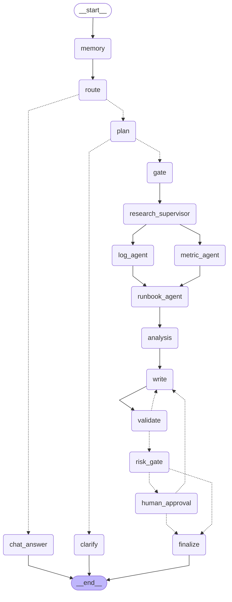

# LangGraph 실제 그래프 (코드에서 자동 생성)

`agent/graph.py`의 build_graph()를 컴파일해 `get_graph().draw_mermaid()`로 뽑은 그림이다. 점선 = 조건 분기.

```mermaid
---
config:
  flowchart:
    curve: linear
---
graph TD;
	__start__([<p>__start__</p>]):::first
	memory(memory)
	route(route)
	chat_answer(chat_answer)
	plan(plan)
	clarify(clarify)
	gate(gate)
	research_supervisor(research_supervisor)
	metric_agent(metric_agent)
	log_agent(log_agent)
	runbook_agent(runbook_agent)
	analysis(analysis)
	write(write)
	validate(validate)
	risk_gate(risk_gate)
	human_approval(human_approval)
	finalize(finalize)
	__end__([<p>__end__</p>]):::last
	__start__ --> memory;
	analysis --> write;
	gate --> research_supervisor;
	human_approval -.-> finalize;
	human_approval -.-> write;
	log_agent --> runbook_agent;
	memory --> route;
	metric_agent --> runbook_agent;
	plan -.-> clarify;
	plan -.-> gate;
	research_supervisor --> log_agent;
	research_supervisor --> metric_agent;
	risk_gate -.-> finalize;
	risk_gate -.-> human_approval;
	route -.-> chat_answer;
	route -.-> plan;
	runbook_agent --> analysis;
	validate -.-> risk_gate;
	validate -.-> write;
	write --> validate;
	chat_answer --> __end__;
	clarify --> __end__;
	finalize --> __end__;
	classDef default fill:#f2f0ff,line-height:1.2
	classDef first fill-opacity:0
	classDef last fill:#bfb6fc
```
